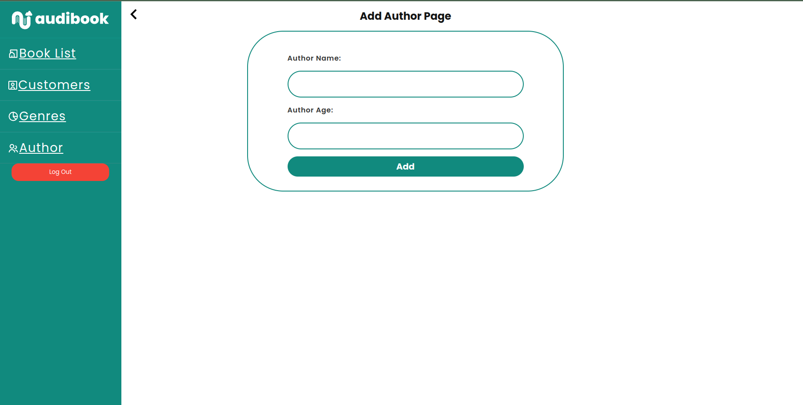
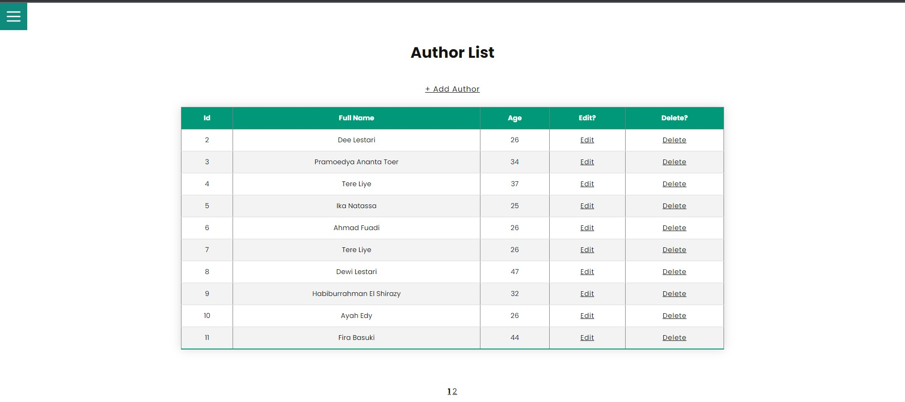
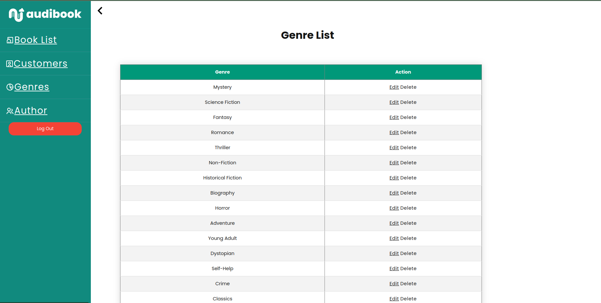
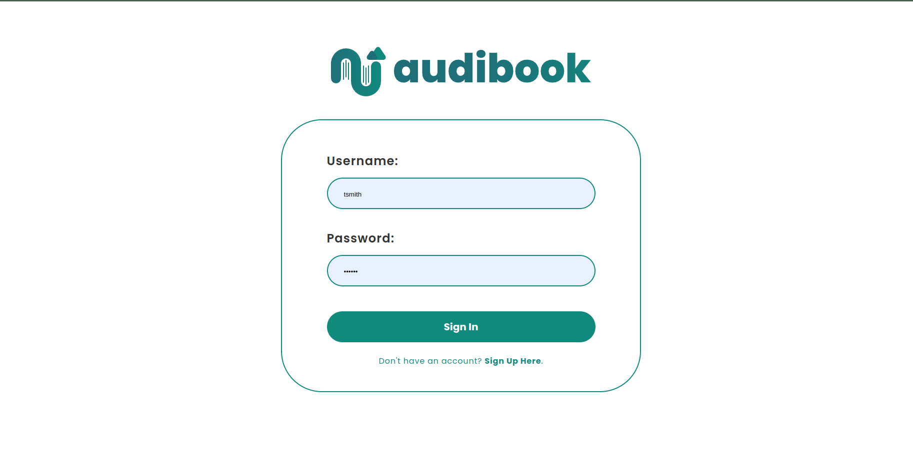
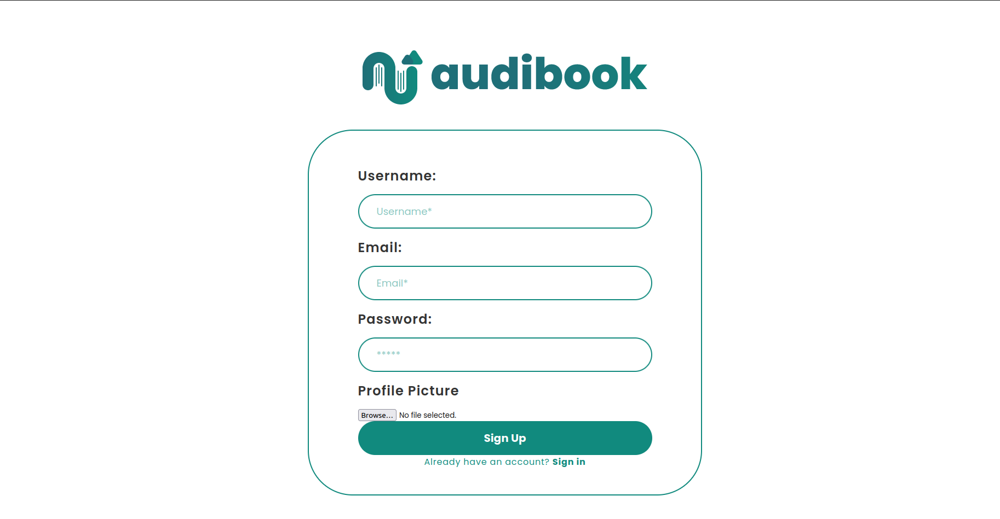
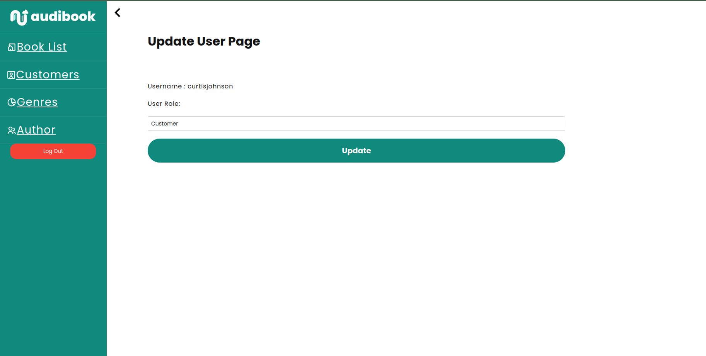
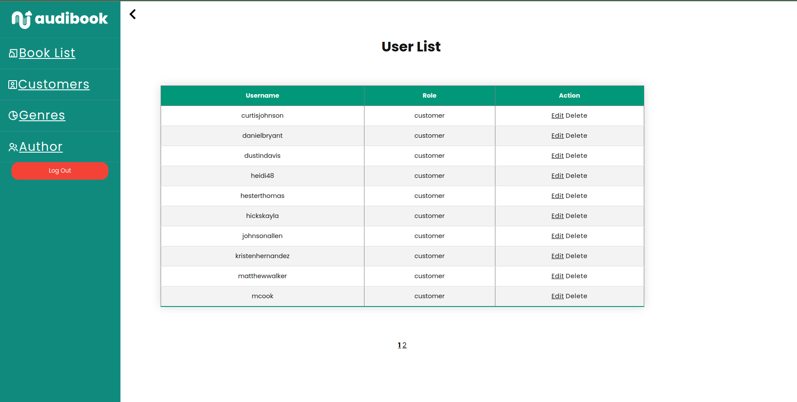

# Tugas Besar 1 - Pengembangan Aplikasi Berbasis Web


## **Deksripsi Web App - Web App Description**

Audibook adalah sebuah website tempat pembelian audio book

## **Daftar Kebutuhan - Requirements List**

1. Pengguna dapat melihat, membeli, dan mencari buku yang diinginkan.
2. Admin dapat mengubah, menghapus, menambahkan pengguna, konten, dan atribut-atribut lain seperti genre dan author.

## **Cara Menginstall dan Menjalankan Program - How to Install and Run The Program**

1. Clone this repository

```sh
git@github.com:moonawar/wbd-10-backup.git
```

2. Change the current directory to `wbd-10-backup` folder

```sh
cd wbd-10-backup
```

3.Build and run your docker containers or run the bat file

```sh
sh clean-run.sh
```

4. Run the server in your localhost with port 8000

```sh
http://localhost:8000/
```
## **Screenshot of Application**












## **Screenshot of Lighthouse**


## **Bonus yang dikerjakan**

1. Dockerize
2. Lighthouse
3. Responsive

## **Pembagian Kerja - Workload Breakdown**

**Anggota Kelompok**

| Nama                   | NIM      | Panggilan |
| ---------------------- | -------- | --------- |
| Alexander Jason | 13521100 | Jason     |
| Addin Munawwar          | 13521085 | Addin  |
| Syahrul Halik     | 10023327 | Syahrul     |

**Server Side:**
| Fitur                | Nim      |
|----------------------|----------|
| Login, Register      | 13521085 |
| Book List            | 13521100 |
| Search, Sort, Filter | 13521100 |
| Model Author         | 13521085 |
| Model Genre          | 13521085, 13521100 |
| Model Book           | 13521085 |
| Model User           | 13521085 |
| Pagination           | 13521085, 13521100 |

**Client Side:**
| Fitur                  | Nim      |
|------------------------|----------|
| Login, Register        | 13521085 |
| Book List              | 13521100 |
| Search, Sort, Filter   | 13521100 |
| Model Author           | 13521100 |
| Model Genre            | 13521100 |
| Model Book             | 13521100 |
| Model User             | 13521085 |
| Add Book, User, Author | 10023327 |
| Not Found Page         | 13521100 |
| Book Details           | 13521100 |
